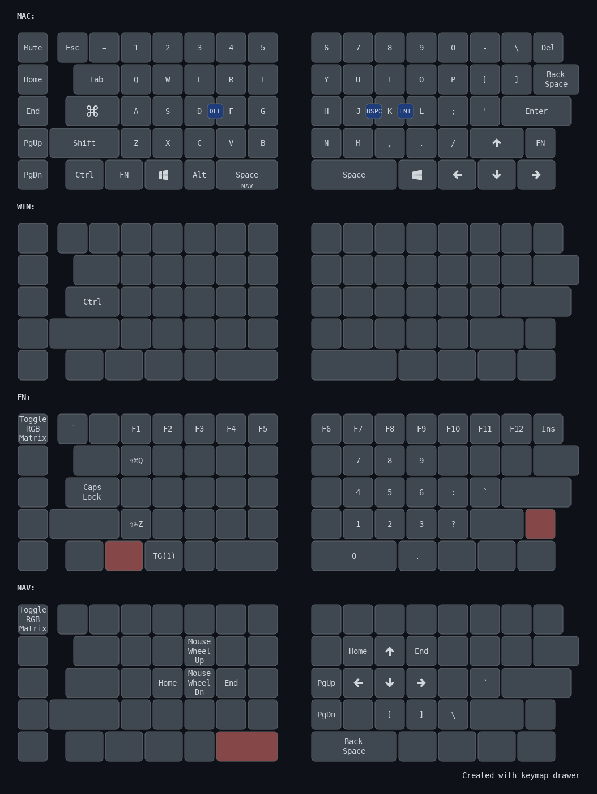

# FoldKB

The Keebio FoldKB is a split ortholinear keyboard that is compatible with a standard keycap set.

## Table of Contents
- [Keymap Overview](#keymap-overview)
- [Layers](#layers)
- [Features](#features)
  - [Caps Word](#caps-word)
  - [Combos](#combos)
  - [Mouse Keys](#mouse-keys)
  - [OS Detection](#os-detection)
- [Building Instructions](#building-instructions)
- [Flashing Instructions](#flashing-instructions)


## Keymap Overview

My FoldKB layout is inspired by the [Datadesk SmartBoard UPC5000](https://www.reddit.com/r/MechanicalKeyboards/comments/cn4gc8/i_have_been_using_this_datadesk_smartboard/) and retains familiar key positions:

- The `=` key is at top left next to 1.
- The Control, Fn, Windows, and Alt keys on the left are in the same positions as the Datadesk SmartBoard.
- The modifier key in the L column is the Windows key; I use this for Windows+L on Windows.

The Caps Lock key is Command for macOS or Ctrl for Windows. This is very comfortable; instead of reaching way down to the corner of the keyboard for Ctrl, just move your pinky over one column from A to Caps Lock. It also maintains muscle memory for physical key combinations; for example, "copy" is always CapsLock+C, regardless of whether you are using Mac or Windows.

I initially configured the bottom right keys with Mod-Tap (for example, hold right Shift for Shift but tap it for up arrow) but found I never used them as modifiers. I made them dedicated arrow keys instead.

The Backspace key is split and is home to backslash/pipe and Del.

The Backspace key takes the place of backslash/pipe.

## Layers

Here is a brief summary of my layers:

|Layer|Purpose|Activation|
|---|---|---|
|0|macOS (Caps Lock = Command)|Default layer|
|1|Windows/Linux (Caps Lock = Ctrl)|Press Fn + Windows to toggle|
|2|Function/Numpad|Hold Fn key|
|3|Navigation|Hold left space|

I split the right Shift key, so I have a 1u Fn key on the right half and a 1.25u Fn key on the left half.

I almost always use my right thumb for spacebar, so the left spacebar is SpaceFN to layer 3.



## Features

This layout is compatible with VIA, allowing real-time keymap changes without reflashing. However, features like combos, Caps Word, and OS detection must be configured in the QMK source code.

### Caps Word

I enabled [Caps Word](https://docs.qmk.fm/feature_caps_word). Double tap left Shift to turn on Caps Word. While active, letters are capitalized and `-` becomes `_`. This makes it easier to type `PROGRAM_CONSTANTS`. I never use Caps Lock, but if I really need Caps Lock, I can access it on layer 2.

### Combos

I have defined the following [combos](https://docs.qmk.fm/features/combo):

|Keys|Output|
|---|---|
|J + K|Backspace|
|D + F|Delete|
|K + L|Enter|

Notice that most of these keys are on the home row, so I do not need to move my hand to reach them. They are also not letters that you are likely to type together in a word, which reduces misfires. L+K is the only exception, but I would have to press them within 50ms of each other, so in practice, typing words like "walk" do not accidentally send Enter.

### Mouse Keys

I enabled [mouse keys](https://docs.qmk.fm/features/mouse_keys) and made the ESDF keys on layer 2 navigation keys. E and D are mouse wheel up and down, and S and F are home and end. This way, I can hold spacebar with my left thumb and use E and D to scroll through a document.

### OS Detection

I enabled [OS detection](https://docs.qmk.fm/features/os_detection) to automatically switch to the appropriate layer. During USB setup, the keyboard makes a best guess at the host OS based on OS specific behavior. If the OS is neither macOS nor iOS, the keyboard activates my Windows/Linux layer.

## Building Instructions

If you have not only done so, set up a QMK external userspace like this:

```
cd $HOME
qmk config user.overlay_dir="$(realpath qmk_userspace)"
```

Compile the firmware like this:

```
qmk compile -kb keebio/foldkb/rev1 -km fansforflorida
```

## Flashing Instructions

Flash the firmware like this:

```
qmk flash -kb keebio/foldkb/rev1 -km fansforflorida
```

You will need to flash both sides separately.
