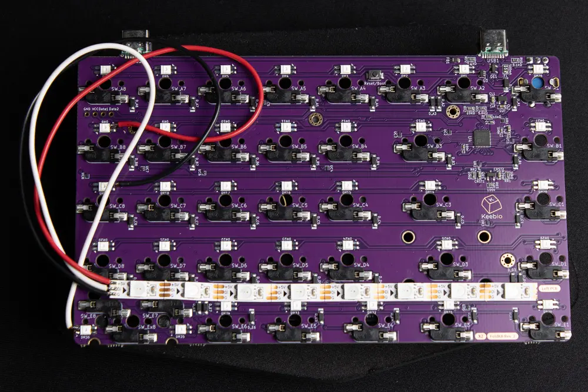
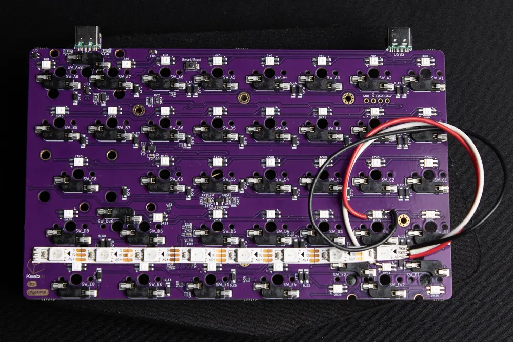

# FoldKB

## RGB Underglow Hardware Modification

Personally, I prefer the look of underglow only. I think it gives the keyboard a cleaner look, especially with a translucent middle layer.

Unfortunately, the FoldKB rev2 does not have RGB underglow. I added an 8-LED WS2812 RGB strip to each half by soldering a wire from the "data out" pin of the last SK6812 MINI-E LED on the PCB to the "data in" pin of the strip. Since the SK6812 MINI-E is a WS2812-protocol-compatible LED, the new strip just extends the existing per-key RGB data chain. No additional pin or driver configuration was needed.





To tell QMK about the new LEDs, I updated two settings in `keyboard.json`:

- `rgb_matrix/layout` - added 8 new LED entries per half, positioned along the bottom edge of each half's layout, with `flags: 2` (underglow) instead of `flags: 4` (per-key) to distinguish them from the existing per-key LEDs.
- `rgb_matrix/split_count` - updated from `[36, 37]` to `[44, 45]` to reflect the new total LED count per half (36 + 8 = 44 on the left half, 37 + 8 = 45 on the right half).

## RGB Behavior

I customized my firmware so that only the RGB underglow is on by default. I also customized the behavior of the `RM_TOGG` key code to cycle through four RGB modes:

1. Underglow only
2. Per-key RGB only
3. All RGB off
4. All RGB on

## Building Instructions

If you have not already done so, set up a QMK external userspace like this:

```bash
cd $HOME
qmk config user.overlay_dir="$(realpath qmk_userspace)"
```

## Syncing `keyboard.json`

QMK's userspace overlay does not pick up `keyboard.json` changes from the QMK userspace. Before running `qmk compile`, manually sync:

```bash
cp keyboard.json ~/qmk_firmware/keyboards/keebio/foldkb/rev2/keymaps/fansforflorida/keyboard.json
```

Compile the firmware like this:

```bash
qmk compile -kb keebio/foldkb/rev2 -km fansforflorida
```

## Flashing Instructions

Flash the firmware like this:

```bash
qmk flash -kb keebio/foldkb/rev2 -km fansforflorida
```

You will need to flash both sides separately.
