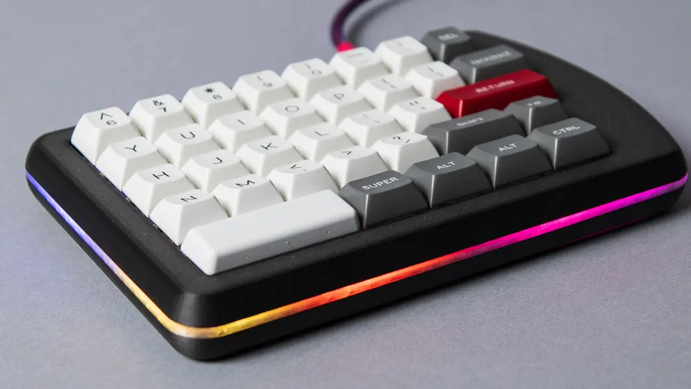
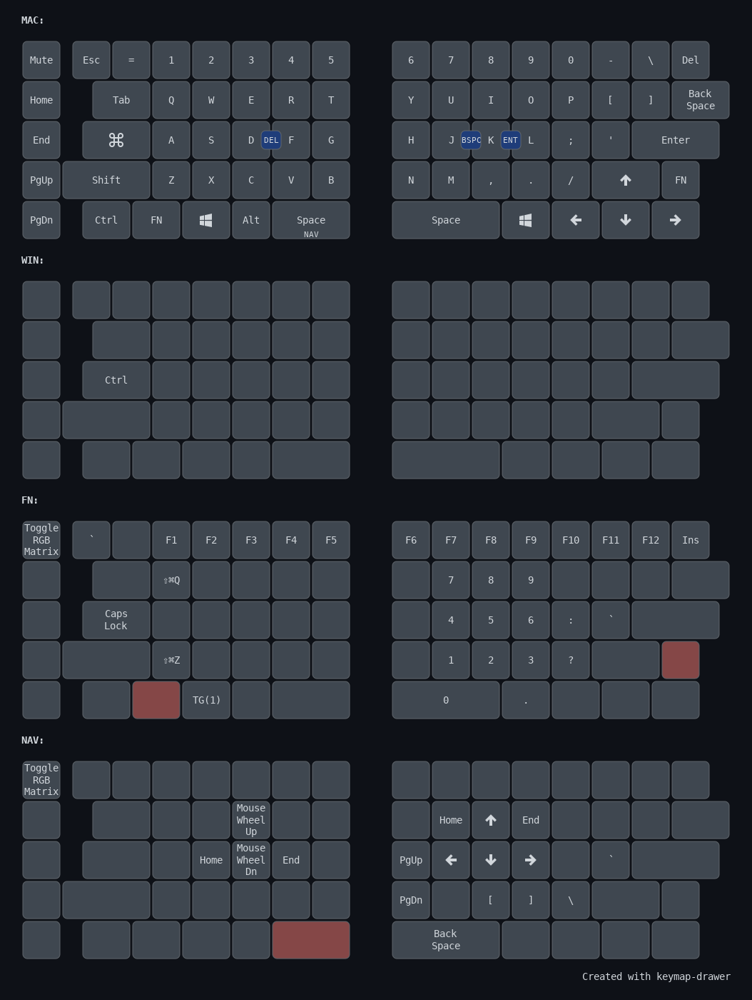

# FoldKB

The Keebio FoldKB is a split ortholinear keyboard that is compatible with a standard keycap set.



## Table of Contents

- [PCB Revisions](#pcb-revisions)
- [Keymap Overview](#keymap-overview)
- [Layers](#layers)
- [Features](#features)
  - [Caps Word](#caps-word)
  - [Combos](#combos)
  - [Encoder](#encoder)
  - [Macros](#macros)
  - [Mouse Keys](#mouse-keys)
  - [OS Detection](#os-detection)
  - [RGB](#rgb)
  - [Tap Dance](#tap-dance)
- [Building Instructions](#building-instructions)
- [Flashing Instructions](#flashing-instructions)

## PCB Revisions

The FoldKB has been produced in three PCB revisions. The table below summarizes the hardware changes for each revision.

| Feature              | Rev1             | Rev2.0       | Rev2.1       |
| -------------------- | ---------------- | ------------ | ------------ |
| Microcontroller      | ATmega32u4       | STM32G431    | STM32G431    |
| Hot swap             | No               | Yes          | Yes          |
| Per-key lighting     | Single-color LED | RGB          | RGB          |
| LED direction        | South-facing     | North-facing | North-facing |
| Underglow            | Yes (RGB)        | No           | Yes (RGB)    |
| ESD protection       | No               | Yes          | Yes          |
| Backslash key width  | 1.5u             | 1u           | 1.5u         |
| Switch compatibility | MX               | MX           | MX           |
| Mounting             | Sandwich         | Sandwich     | Sandwich     |
| Firmware             | QMK/VIA          | QMK/VIA      | QMK/VIA      |

## Keymap Overview

My FoldKB layout is inspired by the [Datadesk SmartBoard UPC5000](https://www.reddit.com/r/MechanicalKeyboards/comments/cn4gc8/i_have_been_using_this_datadesk_smartboard/) and retains familiar key positions:

- The `=` key is at top left next to 1.
- The Control, Fn, Windows, and Alt keys on the left are in the same positions as the Datadesk SmartBoard.
- The modifier key in the L column is the Windows key. I use this for Windows+L on Windows.

The Caps Lock key is Command for macOS or Ctrl for Windows. This is very comfortable. Instead of reaching way down to the corner of the keyboard for Ctrl, just move your pinky over one column from A to Caps Lock. It also maintains muscle memory for physical key combinations. For example, "copy" is always CapsLock+C, regardless of whether you are using Mac or Windows.

I initially configured the bottom right keys with Mod-Tap (for example, hold right Shift for Shift but tap it for up arrow) but found I never used them as modifiers. I made them dedicated arrow keys instead.

The 2u Backspace key is split into backslash/pipe and Delete. The Backspace function moves to the position normally occupied by backslash/pipe.

I have reviewed both the [original FoldKB](https://youtu.be/TcaBeJCXwDg) and the [FoldKB rev2.1](https://youtu.be/ZkBdGoLbNAw) on YouTube if you want to see the keyboard in action.

## Layers

Here is a brief summary of my layers:

| Layer | Purpose                          | Activation                   |
| ----- | -------------------------------- | ---------------------------- |
| 0     | macOS (Caps Lock = Command)      | Default layer                |
| 1     | Windows/Linux (Caps Lock = Ctrl) | Press Fn + Windows to toggle |
| 2     | Function/Numpad                  | Hold Fn key                  |
| 3     | Navigation                       | Hold left space              |

I split the right Shift key into an up arrow key and an Fn key. This gives me a 1u Fn key on the right half and a 1.25u Fn key on the left half.

I almost always use my right thumb for spacebar, so the left spacebar is SpaceFN to layer 3.



## Features

This layout is compatible with VIA, allowing real-time keymap changes without reflashing. However, features like combos, Caps Word, and OS detection must be configured in the QMK source code.

### Caps Word

I enabled [Caps Word](https://docs.qmk.fm/features/caps_word). Double tap left Shift to turn on Caps Word. While active, letters are capitalized and `-` becomes `_`. This makes it easier to type `PROGRAM_CONSTANTS`. I never use Caps Lock, but if I really need Caps Lock, I can access it on layer 2. I enabled `CAPS_WORD_INVERT_ON_SHIFT`, so holding Shift while Caps Word is active temporarily inverts the behavior, outputting lowercase letters.

### Combos

I have defined the following [combos](https://docs.qmk.fm/features/combo):

| Keys  | Output    |
| ----- | --------- |
| J + K | Backspace |
| D + F | Delete    |
| K + L | Enter     |

My choice of combos evolved from my keyboard journey.

The X-Bows keyboard had an extra Backspace key in the middle of the keyboard between G and H. That was about the only thing I liked about that keyboard. Instead of having to reach way up to the corner to hit Backspace, I could hit it with my right index finger.

When I used a Lily58, I put Backspace on the extra key next to H and N. That way, I could still hit Backspace with my right index finger. I put Del on the extra key next to G and B, since it seemed symmetrical.

The combos J+K and D+F are the same idea. I can still hit Backspace with my right index finger.

Notice that these keys are on the home row, so I do not need to move my hand to reach them. They are also not [common bigrams](https://blogs.sas.com/content/iml/2014/09/26/bigrams.html), which reduces misfires. L+K is the only exception. However, I would have to press them within 50ms of each other, so in practice typing words like "walk" or "milk" do not accidentally send Enter.

### Encoder

I configured the rotary encoder using [encoder map](https://docs.qmk.fm/features/encoders#encoder-map). On the default layers (macOS and Windows), the encoder controls volume. On the Function and Navigation layers, it adjusts RGB brightness instead. Pressing the encoder button mutes audio on the default layers, and cycles RGB modes on the Function and Navigation layers.

### Macros

I added a [macro](https://docs.qmk.fm/feature_macros) on Fn+Home that types `cd ~` and presses Enter to change to the home directory in terminal/PowerShell.

### Mouse Keys

I enabled [mouse keys](https://docs.qmk.fm/features/mouse_keys) and made the ESDF keys on layer 3 navigation keys. E and D are mouse wheel up and down, and S and F are the Home and End keys. This way, I can hold spacebar with my left thumb and use E and D to scroll through a document.

### OS Detection

I enabled [OS detection](https://docs.qmk.fm/features/os_detection) to automatically switch to the appropriate layer. During USB setup, the keyboard makes a best guess at the host OS based on OS specific behavior. If the OS is neither macOS nor iOS, the keyboard automatically activates the Windows/Linux layer (Layer 1); otherwise, it uses the default macOS layer (Layer 0).

### RGB

Personally, I prefer the look of underglow only. I think it gives the keyboard a cleaner look, especially with a translucent middle layer. I customized my firmware so that only the RGB underglow is on by default. I also customized the behavior of the `RM_TOGG` key code to cycle through four RGB modes:

1. Underglow only
2. Per-key RGB only
3. All RGB off
4. All RGB on

### Tap Dance

I implemented a custom [tap dance](https://docs.qmk.fm/features/tap_dance) feature on the comma key: a single tap outputs a comma, while a double tap activates Caps Word. Holding Shift during a double tap emits `<<` for guillemets or bitwise operations. Since my middle finger is stronger than my pinky, this combination is easier than double tapping Left Shift to turn on Caps Word.

The idea was inspired by [this Reddit comment](https://www.reddit.com/r/ErgoMechKeyboards/comments/1n201er/comment/nb2tg1s/) from a user of the Hands Down Neu layout, where the comma sits on the home row. I use QWERTY, where the comma is on the bottom row under my middle finger.

## Building Instructions

If you have not already done so, set up a QMK external userspace like this:

```bash
cd $HOME
qmk config user.overlay_dir="$(realpath qmk_userspace)"
```

Compile the firmware like this:

```bash
qmk compile -kb keebio/foldkb/rev2_1 -km fansforflorida
```

## Flashing Instructions

Flash the firmware like this:

```bash
qmk flash -kb keebio/foldkb/rev2_1 -km fansforflorida
```

You will need to flash both sides separately.
