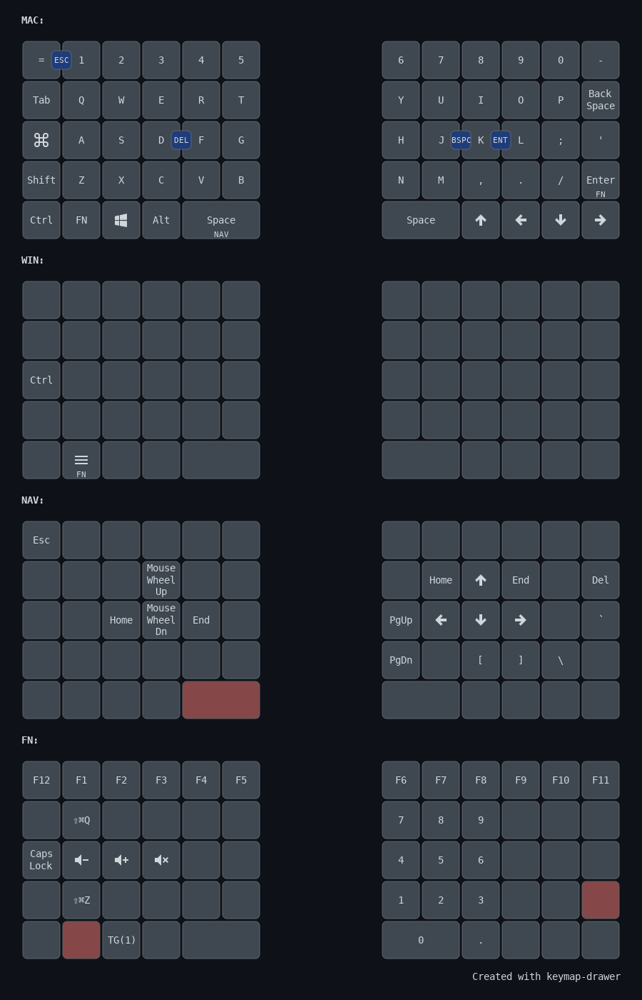

# Nyquist

## Keymap

My Nyquist keymap is based on my FoldKB keymap:

* The `=` key is at top left next to 1.
* The `-` key is at the top right next to 0.
* Backspace is next to P.
* The key next to A is Command for macOS or Ctrl for Windows/Linux.
* The Ctrl, Fn, Windows, and Alt keys are in the lower left in the same order and position as my FoldKB.

Dedicated arrow keys are at the bottom right of the keyboard. Instead of the typical vim arrangement of left, down, up, right, I arranged my arrow keys like this: up, left, down, right. The left, down, and right arrow keys are in the same order as an inverted T arrow cluster; only up is in a different position.

I use my left hand for modifiers, so I put those keys on the left half.

I normally use my right thumb for spacebar, so I made the left spacebar dual function using [Layer-Tap](https://docs.qmk.fm/feature_layers?id=switching-and-toggling-layers). Hold it to access my navigation layer, but tap it for space. This way, I can hold spacebar with my left thumb and use IJKL for arrows, H and N for PgUp and PgDn, and U and O for Home and End with my right hand. This puts the navigation keys right on the home row.

## Layers

Here is a brief summary of my layers:

* Layer 0: Mac layout. The key next to A is Command.
* Layer 1: Windows/Linux layout. The key next to A is Ctrl.
* Layer 2: Navigation layer (activated by holding the left space key). For example:
  * Del is on Backspace
  * `[` is on `<`
  * `]` is on `>`
  * `\` is on `/`
  * `` ` `` is on `'`
* Layer 3: Fn and numpad layer (activated by holding the Fn key below Z). For example, F1-F10 are on the number row, and a tenkey is on my home row:

```
Y U I
H J K
N M <
```

My 2u space key is zero, and the up arrow key is dot. It is not a full numpad, but it is very handy for entering 2FA codes for login or numbers in a spreadsheet without reaching for an external numpad. It uses number row keys to avoid NumLock issues in Windows.



## Features

You can change the keymap using VIA, but there are a few features that I enabled in the firmware:

### Caps Word

I enabled [Caps Word](https://docs.qmk.fm/feature_caps_word). Double tap left Shift to turn on Caps Word. While active, letters are capitalized and `-` becomes `_`. This makes it easier to type `PROGRAM_CONSTANTS`. I never use Caps Lock, but if I really need Caps Lock, I can access it on layer 2.

### Combos

I have defined the following combos:

* J + K emits Backspace
* D + F emits Del
* K + L emits Enter
* `=` + 1 emits Esc

The one thing I liked when I used an X-Bows keyboard was the extra Backspace key between G and H. Instead of having to reach way up to the corner to hit Backspace, I could hit it with my right index finger. When I used a Lily58, I put Backspace on the extra key next to H and N. That way, I could still hit Backspace with my right index finger. I put Del on the extra key next to G and B, since is seemed symmetrical. J+K and D+F are the same idea, except I do not need to move my hand.

Notice that most of these keys are on the home row, so I do not need to move my hand to reach them. They are also not letters that you are likely to type together in a word, which reduces misfires. L+K is the only exception, but I would have to press them within 50ms of each other, so in practice, typing words like "walk" do not accidentally send Enter.

### Mouse Keys

I like that the FoldKB has Home, End, PgUp, and PgDn keys on the left half of the keyboard. This makes it easy to use my left hand to navigate a long document and leaves my right hand free to use the mouse. Inspired by this, I made the ESDF keys on layer 2 navigation keys. E and D are mouse wheel up and down, and S and F are home and end. This way, I can hold spacebar with my left thumb and use E and D to scroll through a document.

### OS Detection

During USB setup, the keyboard makes a best guess at the host OS based on OS specific behavior. If the OS is neither macOS nor iOS, the keyboard activates my Windows/Linux layer.

### RGB Matrix Lighting

I prefer a clean aesthetic with minimal light effects, so I disabled RGB backlighting. However, I kept RGB underglow enabled because my Nyquist case has a frosted stripe in the mid-layer that creates a subtle ambient glow.

## Building

If you have not only done so, set up a QMK external userspace like this:

```
cd $HOME
qmk config user.overlay_dir="$(realpath qmk_userspace)"
```

Compile the firmware like this:

```
qmk compile -kb keebio/nyquist/rev5 -km fansforflorida
```

## Flashing

Flash the firmware like this:

```
qmk flash -kb keebio/nyquist/rev5 -km fansforflorida
```

You will need to flash both sides separately.
