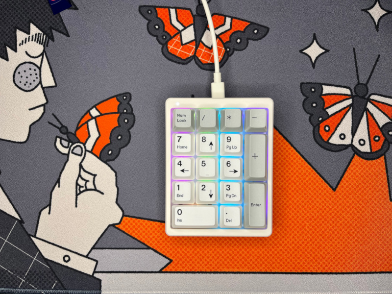

# MF17

The Magicforce MF17 is fully supported by both QMK and VIA. It is entirely plastic (including the switch plate), and the case is held together by clips. It has pre-lubed plate-mounted stabilizers, north-facing RGB, silicone plate foam, and a Poron layer under the switches.

It has a single white LED for the Num Lock indicator, which I repurposed as a layer indicator. It is off on layer zero and lights up when any higher layer is active.
